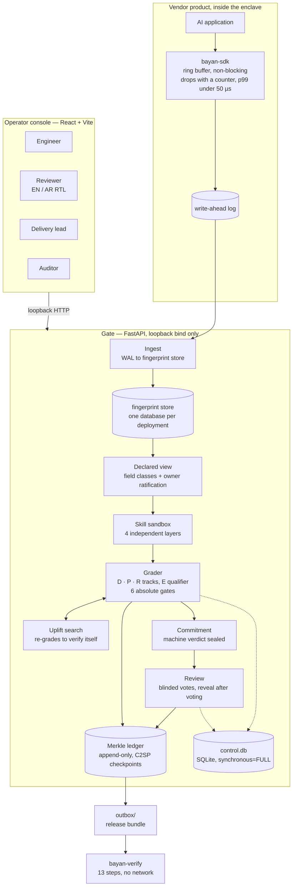

<div align="center">

# Bayan — بيان

**Graded certification for diagnostic data releases from air-gapped AI deployments.**

[](https://www.python.org/)
[](https://fastapi.tiangolo.com/)
[](https://react.dev/)
[](https://www.typescriptlang.org/)
[](#cryptography-the-ledger-and-the-bundle)
[](#the-verifier--13-steps)
[](#about-this-distribution-build)
[](LICENSE)

[Quickstart](#quickstart) · [Scenarios](#the-four-demo-scenarios) · [A release](#what-a-release-looks-like) · [Architecture](#architecture) · [Grading](#the-four-grading-tracks) · [Gates](#the-six-absolute-gates) · [Sandbox](#the-skill-sandbox--four-independent-layers) · [Verifier](#the-verifier--13-steps) · [API](#http-api)

</div>

---

A vendor's AI product runs inside a GCC government client's air-gapped data
centre, and when it misbehaves the engineer cannot see a trace, cannot reproduce
the failure, and cannot legally carry the evidence out. Today that is resolved by
a site visit, a screen read over a shoulder, or a phone photograph nobody logged.

Bayan replaces the ritual with a **declaration**: a signed request, a policy
evaluation that grades the release, a blinded human clearance, a receipt, and an
append-only ledger that survives the air gap — with a certificate that says
exactly what was done to the data, under which rules, on whose authority, and
what that grade does *not* protect against.

> ### This is a reference implementation, not a deployable enclave artifact.
>
> The system design it implements specifies a single static Go binary, a Tessera
> ledger, Parquet storage, PIV reviewer keys and server-rendered HTML. This
> implementation is Python + TypeScript, built to be **local, inspectable and
> iterable**. In particular: there is no single artifact a client security team
> can hash and pin, and all reviewer keys are software keys, so the R-track caps
> at **R3** and every certificate says so on its face.

---

## Quickstart

**Requirements:** Python 3.11+ and Node 20+.

### One command

**macOS / Linux**

```bash
./run.sh
```

**Windows**

```bat
run.bat
```

That checks your toolchain, creates the virtualenv, installs the packages, seeds
the demo dataset, starts the gate on **http://127.0.0.1:8787** and the operator
console on **http://127.0.0.1:5173**, and shuts both down cleanly on Ctrl+C.

Seeding generates 50,000 fingerprints and takes 10–20 seconds. It runs once; the
`var/` directory it creates is reused on later starts. Pass `--reseed` to rebuild
it from scratch.

Then open the console and switch **Acting as** between Omar (engineer), Layla
(reviewer, Arabic), Faisal (reviewer), Priya (delivery lead) and Khalid
(auditor). Nothing loads from a CDN; there is no external font; the UI talks only
to the loopback gate.

### Or step through it manually

```bash
python3 -m venv .venv
./.venv/bin/pip install -e .
./.venv/bin/python scripts/seed.py --data-dir var
./.venv/bin/python -m bayan_gate.main --data-dir var --port 8787
```

```bash
cd packages/ui
npm install
npm run dev                          # → http://127.0.0.1:5173
```

### The offline verifier

A standalone CLI is installed with the package. It is the point of the whole
system: a receipt that can be checked by someone who trusts none of the software
that produced it.

```bash
./.venv/bin/bayan-verify <path-to-bundle>
./.venv/bin/bayan-verify <path-to-bundle> --assert-offline   # refuses to open a socket
```

Exit code `0` means the bundle verified. Every failure mode has its own code, so
a caller can distinguish "signature invalid" from "artefact digest mismatch" from
"ledger fork" without parsing text — see [the verifier](#the-verifier--13-steps).

---

## The four demo scenarios

| Deployment | Pack | What it exercises |
|---|---|---|
| `moi-itsm-prod-01` — Dubai government staff IT-service assistant | `uae-gov` | **The default demo.** 50,000 fingerprints over 90 days; pension-topic retrievals start failing in the last two weeks after an index rebuild. A GREEN skill answers "why are pension queries failing?" at **D2/P3/R1 @ E2** in ~100 µs with no human. Document *identity* drops to D1 and needs two blinded reviewers; the uplift menu recommends `hmac_enclave doc_id (k_floor=5)` and proves it re-grades to D2. A single exemplar (free text) is capped at D0 and quota-limited. |
| `dha-appointment-bot` — DHA patient appointment bot | `healthcare` | PHI. The 18 Safe Harbor identifiers as field defaults; a SENSITIVE diagnosis attribute that reaches D2 only when named in the purpose; the **`PART2`** gate on a substance-use programme identifier (drop only; Part 2 binds the receiving vendor directly). |
| `difc-contract-review` — DIFC deal-desk assistant | `mnpi` | Counterparty names and deal codenames. **`MNPI-CONTAINMENT`** fails as a binary gate: the disqualification certificate cites MAR Art 10 / Art 14(c) and says the fix is changing the **recipient**, not masking harder. The refusal is a ledger leaf. |
| `gulfbank-card-assist` — bank card-services assistant | `financial` | **`PCI-SAD`**: a CVV in a log is unfixable even hashed (Req 3.3.1 "even if encrypted"). **`PCI-PAN`**: truncation to first 8 + any other 4 for 16-digit PANs passes the gate — and the D-track still honestly says D0, because a truncated PAN is a partial identifier. Pack floor: no release below D2 without R4. |

Mock data uses exact GCC identifier formats (Emirates ID `784-YYYY-NNNNNNN-C`,
Saudi NID/Iqama, QID, CPR, UAE mobile/IBAN, Makani), Arabic names in script and
transliteration, Gregorian and Hijri dates, and realistic document IDs such as
`PENSION-CIRCULAR-2024-11`.

Five policy packs ship with the build (`uae-gov`, `ksa-nca`, `healthcare`,
`financial`, `mnpi`) alongside twelve certified skills and six deployments.

---

## What a release looks like

The end-to-end narrative, as the system reports it. Every line below is real
output — a request graded, sealed, reviewed blind, cleared, logged and verified,
then eight deliberate tamper attempts each producing the correct refusal.

```
[ 2] Engineer asks 'why are pension queries failing?' → feasibility matrix
        'Is the service healthy? Error rate by class?' → min data: STRUCTURAL counts,
        achievable D2, policy-clear (R1), real-time=True
        ✓ achievable grade never above D2 without a data pass
        ✓ a certified skill answers it

[ 3] Run certified GREEN skill → D2/P3/R1 @ E2, issuance < 10ms, no human
        ✓ GREEN skill ran: 93 rows
        ✓ certificate D2/P3/R1 @ E2 — runner
        ✓ issuance 178 µs < 10 ms
        ✓ auto-cleared: no human needed, receipt in the ledger
        pension failures by week (last two): [('2026-W35', 456), ('2026-W36', 297)]

[ 4] Engineer needs document identity → D1, two reviewers (R3), drop explained
        ✓ document identity (QUASI, untransformed) never above D1
        ✓ the drop is explained: doc_id — quasi-identifier untransformed —
          D2 requires drop, bucket, coarsen or hmac_enclave.

[ 5] Uplift menu targeting D2 → recommended option re-grades to D2 when applied
        1  hmac_enclave doc_id (k_floor=5)   ✓ D2  keeps: relative doc_id frequency  ← recommended
        2  drop doc_id                       ✓ D2  loses: doc_id
        ✓ applied → D2/P3/R1 @ E2: the search verified itself

[ 7] DIFC deal-desk: counterparty_name → MNPI-CONTAINMENT FAILS
        ✓ names the rule: MAR Art 10 / Art 14(c)
        ✓ fix is changing the RECIPIENT, not masking harder

[ 8] Reviewer 1 opens the brief → machine verdict absent, /reveal 403
        ✓ 'machineCheck', 'rrsaClass', 'findings', 'nonce' absent from the brief
        ✓ Arabic brief rendered RTL from the pack template, reviewer named
        ✓ GET /reveal → 403 before voting

[10] Requester attempts to review own request → rejected
        ✓ rejected at submission (R-E4)
        ✓ independently rejected at grading (second layer)

[13] Corrupt an artefact → exit 60
[14] Add an unlisted file to artefacts/ → exit 60
[15] Tamper the commitment → exit 50
[16] Forge a second checkpoint → exit 70  (two checkpoints at size 2, different roots: FORK)
```

Three things to notice:

- **The grade is issued in microseconds, without reading a row.** 178 µs for a
  50,000-fingerprint deployment, because D0–D2 grading is a function of the
  manifest, not of the data.
- **Refusals are first-class.** The MNPI disqualification is not an error path;
  it is a signed certificate and a leaf in the ledger, so a refusal is as
  auditable as a release.
- **Each tamper produces a *specific* exit code.** A corrupted artefact (60) is
  distinguishable from a broken commitment (50) and from a forked ledger (70)
  without reading any prose.

---

## Architecture



The same path in one line, from the host application to an auditor who trusts
none of it:

```
 host app ──bayan-sdk──▶ WAL ──▶ gate ingest ──▶ declared view ──▶ skill (SQL, sandboxed)
                                                                      │
                     manifest (classes × transforms) ──▶ grader ──▶ certificate D/P/R @ E + gates
                                                                      │
        request.dsse ──▶ machine verdict SEALED (commitment) ──▶ blinded reviews ──▶ clearance.dsse
                                                                      │
                                       ledger leaf = clearance ──▶ checkpoint ──▶ receipt.dsse ──▶ outbox/
                                                                                              │
                                                              bayan-verify (offline, no network) ◀──┘
```

**Reading it:** the SDK never blocks the host application — it writes to a ring
buffer and drops with a counter under pressure. The gate ingests the write-ahead
log into a per-deployment fingerprint store. A *skill* is parameterised SQL over a
**declared view**, never code. Its manifest — field classes crossed with applied
transformations — is what the grader reads; the grader never sees a row. The
machine's verdict is committed before any human is shown anything. Human votes
are blinded from each other. The clearance becomes a ledger leaf, the checkpoint
signs a prefix of that history, and the receipt plus the artefacts become a
bundle that verifies offline.

The core is pure logic with no framework and no I/O — the single exception is the
ledger, because a ledger is a file.

---

## Core concepts

| Primitive | What it is |
| --- | --- |
| **Fingerprint** | One structural record of an interaction — no content, only shape: timing buckets, topic, route, finish reason, error code, token buckets, guardrail flags. |
| **Field class** | The declared nature of a column. Proposed by the vendor, **ratified by the data owner**; an unratified class caps any skill touching it at D1 whatever its risk class. Ratification precedence beats risk class. |
| **Skill** | Parameterised SQL over a declared view, with a declared output schema. Certified once, run many times. Never code. |
| **Manifest** | Field classes × applied transformations for one release. The grader's only input about the data. |
| **Certificate** | D/P/R levels at an E qualifier, plus gate results, blockers, findings and the nearest reachable form. Issued for refusals too. |
| **Request → Clearance → Receipt** | Three signed DSSE envelopes. The request states intent; the clearance records the human decision; the receipt lists every artefact by digest. |
| **Bundle** | What leaves the enclave: `request.dsse`, `clearance.dsse`, `receipt.dsse`, `checkpoint.txt`, `timestamp.tsr`, `manifest.json`, `trust/keys.json`, plus the artefacts. |

### The six field classes

| Class | Meaning |
| --- | --- |
| `DIRECT` | Identifies alone |
| `QUASI` | Identifies in combination |
| `SENSITIVE` | The attribute being protected |
| `STRUCTURAL` | Shape of the interaction, no subject semantics |
| `VENDOR` | Vendor artefact, not client-derived |
| `FREETEXT` | Unstructured natural language |

### The eight transformations

Ordered by information destroyed — the uplift search uses this as its cost
function, so it prefers the cheapest transformation that reaches the target grade:

| Transformation | Utility cost | Satisfies |
| --- | --- | --- |
| `coarsen`, `round` | 1 | `coarsen` counts toward D2 for QUASI |
| `bucket`, `truncate`, `mask`, `aggregate` | 2 | `bucket` counts toward D2 for QUASI |
| `hmac_enclave` | 3 | D1 for DIRECT, D2 for QUASI |
| `drop` | 4 | Everything, including the only option for FREETEXT |

`DIRECT` fields reach D1 only via `drop` or `hmac_enclave`. `QUASI` fields reach
D2 only via `drop`, `bucket`, `coarsen` or `hmac_enclave`. **`FREETEXT` has
exactly one acceptable transformation — `drop`. There is no third option.**

---

## The four grading tracks

Three independent tracks and one qualifier. They are deliberately not collapsed
into a single number, because they answer different questions and fail for
different reasons.

### D — what was done to the data

A pure function of *declared field classes × applied transformations*. The
grading entry point has no parameter that can carry rows, which is why
certification time is flat from 100 to 100,000 rows.

The honest part of the D-track is that each level publishes **what it does not
stop**:

| Level | What it does *not* stop |
| --- | --- |
| **D0** | Everything. D0 is raw; it exists so that break-glass and exemplars have a name. |
| **D1** | Quasi-identifier combination. ZIP + sex + DOB is a D1 pass and a re-identification. |
| **D2** | Linkage against auxiliary data the declared QI list did not anticipate. Sequence and differencing attacks. |
| **D3** | Composition across releases. Nothing about D3 survives being run twice (Denning 1979). |
| **D4** | Nothing at the individual level, correctly — but utility is often unacceptable. |

D0–D2 are decided from the manifest alone. D3 and D4 are asynchronous promotions
from facts produced elsewhere, never a synchronous claim.

### P — how the extraction was produced

Each level requires every fact of the level below. Facts are booleans established
by the runtime, never inferred from the output.

| Level | Requires |
| --- | --- |
| **P0** | Ad hoc extraction: no named skill and version |
| **P1** | A named skill and version |
| **P2** | + verified skill signature, inputs bound by digest |
| **P3** | + pre-certification, runtime schema enforcement, reproducibility |

### R — who authorised it

Checked here independently of the API, so an API bug cannot manufacture a review
level.

| Level | Condition |
| --- | --- |
| **R0** | No review, self-approved, break-glass, or **separation of duties violated** — the requester appears as a reviewer |
| **R1** | Policy-cleared: the human judgement happened at skill certification |
| **R2** | One named approver, with a recorded justification |
| **R3** | Two distinct approvers, **both blinded** — a second approval that was not blinded is not independent |
| **R4** | + a hardware-backed key holding a named authority with verified attributes |

In this implementation every reviewer key is `key_type=software`, so **R4 is
unreachable and the certificate says so**, naming the reason rather than silently
capping.

### E — the environmental qualifier

A **separate axis**. Computed from recipient facts alone; it never reads or
rewrites a track level.

| Level | Condition |
| --- | --- |
| **E0** | Recipient is not a named organisation, or the purpose is not limited |
| **E1** | Named org + purpose limited |
| **E2** | + named individuals, attributes verified, onward transfer prohibited, disposal bound |
| **E3** | + receiving environment assessed |

A certificate reads `D2/P3/R1 @ E2`: what was done to the data, how it was
produced, who authorised it — and, separately, where it is going.

---

## The six absolute gates

Gates are binary and they are not gradeable. A failed gate produces a
disqualification certificate that names the rule and states the fix — and the
refusal is entered in the ledger as a leaf, exactly like a release.

Every gate result carries a machine-readable fix class — `drop_field`,
`change_recipient`, `legal_instrument`, `not_evaluable` or `none` — so the console
can tell an engineer *what kind of problem this is* before it tells them the prose.

| Gate | Citation | Fails when | Fix class and what it says |
| --- | --- | --- | --- |
| `PCI-SAD` | PCI DSS v4.0.1 Req 3.3.1 (3.3.1.1 track data, 3.3.1.2 card verification code, 3.3.1.3 PIN block) | Sensitive authentication data is present after authorisation | `drop_field` — remove the field entirely. SAD is not stored after authorisation *"even if encrypted"*; masking, hashing or encryption does not cure it |
| `PCI-PAN` | PCI SSC FAQ #1091 | A PAN is present without acceptable truncation | Truncate to first 8 + any other 4 for a 16-digit PAN, first 6 + last 4 for a 15-digit Amex — or `hmac_enclave`. (The v3.2.1 "first six" rule is merely stricter and also passes) |
| `MNPI-CONTAINMENT` | MAR Art 10 / Art 14(c) — unlawful disclosure of inside information | Inside information would reach a person not on the insider list | `change_recipient` — **cannot be satisfied by transforming the payload.** A deal is identifiable from its shape and pseudonymisation does not cure it |
| `EXPORT-DEEMED` | ITAR §120.50(b) deemed export; §120.54(a)(5) encryption carve-out | Controlled technical data would reach a person holding citizenship or residency outside the pack's permitted set | `change_recipient` — change the recipient, obtain a licence, or satisfy the §120.54(a)(5) end-to-end encryption carve-out. **The gate constrains the accessor, so without the recipient's citizenship set and physical location it returns `not_evaluable` and the pack refuses to certify** rather than guessing |
| `PRIVILEGE` | FRE 502(d) (evidence rule, not civil procedure); FRCP 26(b)(5) privilege log | Attorney-client or work-product material would cross to a third party | `legal_instrument` — a partial disclosure is still a disclosure; obtain an FRE 502(d) order, or drop the fields |
| `PART2` | 42 CFR Part 2 §2.12(d) (binds any lawful holder), §2.32 (redisclosure notice) | A substance-use-disorder programme record is present | `drop_field` — the mere fact of being a patient of a Part 2 programme is itself protected, and Part 2 binds the receiving vendor directly |

---

## The skill sandbox — four independent layers

A skill is parameterised SQL over a declared schema, never code. Four layers run
independently, so bypassing one does not bypass the next.

| Layer | What it does |
| --- | --- |
| **1 — Declaration** | A `STRUCTURAL` output column must be enumerated or integer. Never a free string, never a float. The channel is closed by declaration, before the skill ever runs. |
| **2 — Static analysis** | The SQL is parsed to an AST; anything not provably confined to the declared inputs and the function allowlist is rejected — at certification, and again at load. |
| **3 — Execution limits** | A read-only connection under an authorizer that denies any read outside the declared inputs, plus a wall-clock timeout (30 s), a row ceiling, and a heap ceiling (256 MB). |
| **4 — Output conformance** | Structural rules run first and detection last, because detection erodes and structure does not. |

The layer-4 rules, in fixed order — each adversarial case in the smuggling corpus
isolates exactly one of them:

`S1` structural type · `S2` enum domain and type · `S3` integer range and type ·
`S4` row order (sorting is applied as a *transformation*: it destroys the
log₂(n!)-bit ordering channel) · `S5` cardinality · `S6` pseudonym shape ·
`S7` text type · `S8` pattern shape.

A conformant run of a certified skill inherits the skill's certificate. A
non-conformant run is **quarantined, never downgraded** — and two quarantines
decertify the skill.

---

## Cryptography, the ledger and the bundle

| Component | Specification and invariant |
| --- | --- |
| **Canonical JSON** | The same object always serialises to the same bytes. NaN, Infinity, non-string keys and duplicate input keys are rejected rather than tolerated. Every signature depends on this. |
| **Signatures** | Ed25519. Trust derives *solely* from a signature verifying against a key already in the trusted set — a key name or keyid is a hint for which key to try, never a security decision. |
| **Envelopes** | DSSE v1.0.2. `payloadType` is inside the PAE and therefore authenticated; a (t,n) threshold counts **distinct** trusted keys; the payload is parsed exactly once, from the bytes that were verified. |
| **Merkle log** | RFC 6962: `leaf = H(0x00 ‖ data)`, `node = H(0x01 ‖ l ‖ r)`. The domain-separation prefixes are what prevent a leaf being confused with an internal node. Inclusion and consistency follow RFC 9162 §2.1.3–2.1.4. |
| **Checkpoints** | C2SP tlog-checkpoint over signed-note. The signed message is exactly the three-line note body (origin, size, base64 root), each newline-terminated. |
| **Commitment** | A hash over `{verdict, rrsaClass, findings, nonce}` in canonical form, sealed before any human sees the request. It opens for exactly that verdict and nothing else. |
| **Ledger store** | `<dir>/leaves/<8-digit index>.leaf` and `<dir>/checkpoints/<size>.txt`. An acknowledged append is durable; the store never rewrites a leaf; a corrupted tail is **declared, not concealed**. |

A release bundle is:

```
request.dsse      the signed request — intent, manifest, recipient
clearance.dsse    the signed human decision
receipt.dsse      every artefact listed by digest
checkpoint.txt    signed C2SP checkpoint over a prefix of the ledger
timestamp.tsr     a signed note over the receipt digest and a time, made outside the enclave
manifest.json     field classes × transformations
trust/keys.json   copied in for convenience — trust is out-of-band
artefacts/        the released data
```

---

## The verifier — 13 steps

`bayan-verify` runs offline and refuses to open a socket under `--assert-offline`.
Each step maps to a distinct exit code, so a caller can branch on the failure
class without parsing text.

| Step | Check | Exit code on failure |
| --- | --- | --- |
| 0 | Trust root | `10` |
| 1 | Envelope signatures | `10` |
| 2 | Threshold (t of n distinct keys) | `10` |
| 3 | Schema | `20` |
| 4 | Chain (request → clearance → receipt) | `20` |
| 5 | Profile pinning | `30` |
| 6 | Separation of duties | `40` |
| 7 | Commitment opening | `50` |
| 8 | Artefact digests | `60` |
| 9 | Inclusion proof | `70` |
| 10 | Consistency (fork detection) | `70` |
| 11 | Time | `10` |
| 12 | Retention | `80` |

Exit `0` means all 13 passed.

---

## The five invariants

1. **Over-grading must be impossible.** Every assertion about a grade is
   directional: *never higher than X*. Mutation testing is scored on over-grading
   mutants only.
2. **D0–D2 grading never touches the data.** The grading entry point has no
   parameter that can carry rows; certification time is flat in row count. D3 is
   an asynchronous upgrade.
3. **The machine verdict is sealed before the human sees anything.** Its
   commitment is published at request time; the review endpoint never carries it;
   the reveal endpoint is `403` until *that* reviewer has voted — enforced
   server-side.
4. **The requester can never review their own request** — rejected at vote
   submission, again by the grader, and again by the verifier's step 6.
5. **Free text never rises above D0.** A `FREETEXT` field is dropped or the
   release is D0. There is no third option.

---

## HTTP API

All routes are versioned under `/v1` and require an identity header
(`x-bayan-user`). The gate binds to loopback only.

**Discovery and context**

| Method | Path | Purpose |
| --- | --- | --- |
| `GET` | `/v1/health` | Liveness. The only unauthenticated route |
| `GET` | `/v1/me` | The calling principal: id, display name, role, key type, language |
| `GET` | `/v1/principals` | Directory of principals |
| `GET` | `/v1/deployments` | Deployments, their pack, recipient facts and declared view |
| `GET` | `/v1/packs/{pack_id}` | One policy pack, with every rule's citation and evidence tier |
| `GET` | `/v1/skills` | Certified skills available for a deployment |
| `GET` | `/v1/feasibility` | Given a question, the minimum data and the achievable grade — **before** anything runs |

**Running a skill**

| Method | Path | Purpose |
| --- | --- | --- |
| `POST` | `/v1/dryrun` | Grade a proposed run without producing output |
| `POST` | `/v1/runs` | Run a certified skill; returns a certificate |
| `GET` | `/v1/runs/{run_id}` | One run with its certificate |
| `POST` | `/v1/runs/{run_id}/uplift` | The uplift menu for a target grade (default `D2`) |
| `POST` | `/v1/runs/{run_id}/uplift/apply` | Apply an option and re-grade to prove it |
| `POST` | `/v1/runs/{run_id}/upgrade` | Request an asynchronous D3 promotion |
| `GET` | `/v1/jobs/{job_id}` | Status of an asynchronous job |

**Release and review**

| Method | Path | Purpose |
| --- | --- | --- |
| `POST` | `/v1/requests` | Create a release request; seals the machine verdict |
| `GET` | `/v1/requests/{rid}` | One request |
| `GET` | `/v1/review/queue` | This reviewer's queue |
| `GET` | `/v1/review/{rid}` | The reviewer brief — **never carries the machine verdict**; `?lang=ar` renders RTL |
| `POST` | `/v1/review/{rid}/vote` | Cast a blinded vote with a recorded justification |
| `GET` | `/v1/review/{rid}/reveal` | The machine verdict. **403 until this reviewer has voted** |
| `POST` | `/v1/review/{rid}/resolve` | Resolve; writes the receipt and the bundle to `outbox/` |

**Audit**

| Method | Path | Purpose |
| --- | --- | --- |
| `GET` | `/v1/ledger` | The ledger for a deployment, with integrity status |
| `GET` | `/v1/register` | Every request with its certificate label — releases *and* refusals |
| `GET` | `/v1/bundles/{release_id}` | A release bundle |
| `GET` | `/v1/budget` | Remaining budget and exemplar quota for a deployment/cohort |
| `GET` | `/v1/summary` | Deployment summary |
| `GET` | `/v1/records` | Records that *have* a content pointer — candidates for an exemplar. **Never the content** |

---

## Configuration

| Variable | Default | Purpose |
| --- | --- | --- |
| `BAYAN_DATA_DIR` | `var` | The one data directory. Everything is a file under it |
| `BAYAN_PORT` | `8787` | Gate port |
| `BAYAN_ALLOW_NETWORK_FS` | unset | Permit a data directory on a network filesystem (refused by default) |
| `BAYAN_GATE` | `http://127.0.0.1:8787` | The console's dev-server proxy target |

`run.sh` / `run.bat` set `BAYAN_GATE` for you when you override `GATE_PORT`.

Fixed by design rather than configuration: the gate binds only to
`127.0.0.1`/`::1`/`localhost`; skills run under a 30-second wall clock and a
256 MB heap ceiling; the control database runs with `synchronous=FULL`.

The data directory layout:

```
var/
  control.db          SQLite: deployments, principals, skills, runs, requests, reviews, budget
  fingerprints/       one database per deployment
  keys/               signing keys (never committed — see .gitignore)
  ledger/             leaves/ and checkpoints/       (created on first release)
  outbox/             completed release bundles      (created on first release)
  trust/              the out-of-band trusted key set
  audit.jsonl         append-only operational audit
  wal/, inbox/        SDK write-ahead log and ingest staging
```

---

## What was verified

This build was validated against the full development test suite before
packaging. The suite is not shipped in this distribution; the results are
reproduced here so you know what the guarantees rest on.

| Area | What was asserted |
| --- | --- |
| **Cryptography** | RFC 9162 Merkle vectors; the DSSE PAE spec vector; *t−1* signatures fail and *t* pass; the same key twice fails; the commitment opens for the true verdict and fails for **every single-field mutation** |
| **Schema** | 16 property tests, deterministic across 5 consecutive runs, with **zero surviving over-grading mutants** |
| **Grader** | **100% branch coverage** on the grader and gates; golden certificates for 14 scenarios; certification time **flat from 100 to 100,000 rows** |
| **Sandbox** | A 13-case SQL-smuggling corpus against the production checker (11 closed, 2 explicit documented residuals); static SQL analysis; executor limits; quarantine and decertification |
| **Verifier** | A good bundle exits 0; **eight distinct corruptions each produce their specific exit code**; the CLI runs with sockets disabled |
| **API** | Reveal is 403 before this reviewer has voted and 200 after; the machine verdict appears in no other response body; requester-as-reviewer is rejected; approving above baseline without a typed reason is rejected |
| **SDK** | Emit is non-blocking, drops with a counter, and **p99 < 50 µs** |
| **Packs** | Every rule in every pack carries id, citation, verbatim quote, evidence tier and pack version; unverified sources are advisory; no gate has an off-switch |
| **Console** | No pre-selected approve; diff-first; loss-framed counts; accountability text above the signing control; one-action reject vs confirmed approve; sealed-until-voted; RTL Arabic — asserted in unit tests and again in browser tests against a real seeded gate |
| **End to end** | A **17-step** narrative: seed → request → grade → seal → blinded review → clearance → checkpoint → receipt → offline verify, then eight deliberate tamper attempts each producing the correct refusal |
| **Types** | `mypy --strict` across the core package |
| | **283 automated checks plus the 17-step narrative. All passing.** |

---

## Engineering notes

- **Purity discipline.** `bayan_core` has no framework and no I/O — the single
  exception is the ledger store, because a ledger is a file. The grader cannot
  reach a row even by accident: no entry point takes one.
- **Directional assertions.** Every test about a grade asserts *never higher
  than*, never *equals*. Mutation testing is scored only on mutants that would
  raise a grade, because those are the ones that matter.
- **One canonicalisation.** Every byte that is signed or hashed passes through
  `canonical_json` first, and a verified payload is never re-parsed — the
  verified-bytes wrapper is the only way to reach it.
- **Layered enforcement.** Separation of duties is refused at vote submission, at
  grading, and again at verification step 6. Sandbox layers are independent by
  construction. Nothing important is enforced in exactly one place.
- **Refusal as a first-class output.** A disqualification is a signed
  certificate and a ledger leaf. The register lists releases and refusals side by
  side, so "what did you decline?" is as answerable as "what did you release?".
- **Honest ceilings.** When a level is unreachable — R4 with software keys — the
  certificate names the reason rather than silently capping.
- **Offline by construction.** The verifier runs under a socket guard in CI, and
  the whole Python suite plus the smoke narrative run inside an empty network
  namespace, so a library that phones home fails there rather than in an enclave
  months later.

---

## Limitations — what this does not prove

Reproduced from the verifier specification, because a verifier that overclaims is
worse than none:

- **It does not prove the released data was correctly redacted.** It proves what
  was released, under which rules, on whose authority. Whether the rules were
  adequate is a human judgement the receipt records but cannot make.
- **It does not detect a disclosive *sequence* of individually compliant
  releases.** No per-release check can. The budget bounds it; the ledger makes it
  auditable afterwards. This is an accepted, documented residual risk.
- **It does not detect a compromised gate.** If the gate is subverted, it signs
  whatever it is told to sign.
- **It does not establish that the vendor deleted its copy.** It establishes that
  the vendor *attested* to deletion, signed, at a verifiable time.

And, specific to this reference implementation: there is no pinnable binary
digest, reviewer keys are software keys (R4 unreachable), the timestamp token is
a signed note rather than RFC 3161, and identity is a request header rather than
a session.

---

## Troubleshooting

- **`ModuleNotFoundError: bayan_core` on macOS.** Some setups flag files created
  under the venv as *hidden*, and CPython then skips the editable `.pth` file.
  Run `./.venv/bin/python scripts/dev_pth.py`, which clears the flag and writes a
  plain path file. `run.sh` does this for you.
- **The gate refuses to start on a network filesystem.** That is deliberate. Use
  local storage, or set `BAYAN_ALLOW_NETWORK_FS=1` for a throwaway demo.
- **Port already in use.** `run.sh` / `run.bat` check both ports before starting
  and stop with a message rather than half-starting. Pick different ones with
  `GATE_PORT=8788 UI_PORT=5174 ./run.sh` — the console's API proxy follows the
  gate port automatically. To bypass the check entirely, set `SKIP_PORT_CHECK=1`.

---

## About this distribution build

This repository is a **distribution build**. It runs exactly as the development
tree does — same gate, same grader, same verifier, same console — but it is
packaged for evaluation rather than modification:

- Identifiers are name-mangled and the sources are minified.
- Docstrings, comments and the six design specifications are not included.
- The development test suite and build tooling are not included.

Everything documented above is reproducible from this repository. If you need a
readable, modifiable source tree — for an audit, a security review, or to build
on it — that is a separate licensing conversation.

---

## Licence

[Apache License 2.0](LICENSE). © Saswat Mishra.
